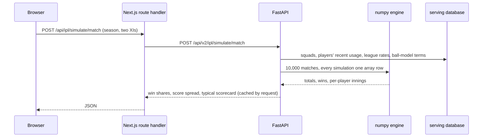

<div align="center">

# CricIQ

### AI-Powered Cricket Intelligence Platform

**Decode the game. Predict the next move.**

[](https://github.com/mehulp007/CricIQ/actions/workflows/ci.yml)


**[Run every competition on localhost](#run-it-on-your-machine)** · [Live demo, IPL edition → criciq-eight.vercel.app](https://criciq-eight.vercel.app) · [Read the write-up](https://criciq-eight.vercel.app/writeup)


</div>

---

CricIQ turns every ball of men's cricket that [Cricsheet](https://cricsheet.org) records into interactive analytics: **Tests, ODIs and T20 internationals, the IPL, and the BBL, CPL, PSL and SA20** (about 9,900 matches and 4.6 million balls). For each competition you can replay any match ball by ball with an explainable win probability and a projected total after every delivery, follow every international series and tournament with its tables and knockouts, explore every player's career in every format measured against par, read any batter-vs-bowler rivalry without over-reading small samples, rate players with honest allowances for sample size, see the pressure on every ball, rebuild any season, and play any two limited-overs sides 10,000 times (Tests have a chase calculator instead). New matches arrive within days of being played.

It is built as a **full ML product, not a dashboard**. Raw data goes through data engineering, then leak-free feature engineering, statistically validated models (each kind of cricket modelled from its own matches only), explainability, a versioned API and the frontend.

> **Two editions.** The [hosted demo](https://criciq-eight.vercel.app) is **v1.0.0, the IPL edition** (branch `main`). **v2, all of men's cricket, lives on the [`v2` branch](https://github.com/mehulp007/CricIQ/tree/v2) and runs on your own machine**: one command downloads the data, builds every competition and serves the site at http://localhost:3000 ([how](#run-it-on-your-machine)). The story of how it was built, including what failed, is in [the write-up](https://criciq-eight.vercel.app/writeup); the [changelog](CHANGELOG.md) records every milestone.

## Run it on your machine

The full site (every competition, the API and the web app) runs locally.

**You need** Python 3.12 via [uv](https://docs.astral.sh/uv/), Node 24 with [pnpm](https://pnpm.io), [just](https://just.systems) (`uv tool install rust-just`), about 2 GB of free disk and an internet connection for the first download.

```bash
git clone -b v2 https://github.com/mehulp007/CricIQ.git
cd CricIQ
just setup            # Python and web dependencies, git hooks
just v2-up            # download Cricsheet, build and validate every competition, score every ball, serve
```

The first `just v2-up` takes a few minutes: it downloads about 45 MB of Cricsheet archives, builds
the warehouse (about 1.5 GB of local data under `data/`), validates it, exports a serving database
per competition, scores every ball with the committed models, builds the web app for production
and starts both servers. Then open
**http://localhost:3000** (use `localhost`, not `127.0.0.1`) and pick a competition in the top bar;
the API and its docs are at http://localhost:8000/docs. Ctrl+C stops both.

| Afterwards | Command |
|---|---|
| Start the site again, without rebuilding | `just v2-up --serve-only` |
| Rebuild from the last download, offline | `just v2-up --no-download` |
| Work on the web app (Next.js dev server, reloads on edits) | `just v2-up --serve-only --dev` |
| Take in new and corrected matches (seconds to a couple of minutes) | `just sync`, then `just sync-status` |
| Retrain one model group (the IPL, leagues, T20Is, ODIs or Tests; hours) | `just train-group <group>`, then `just publish-models` |

A running site picks up a sync by itself: the API swaps in the new data between requests. To keep
the data fresh automatically, schedule `just sync` (every 6 hours works well; on Windows, Task
Scheduler). Models are never retrained by a sync.

## At a glance

The IPL's models, the first built; every competition's results are in its Model Insights page and
in the sections below.

| | Result (tested once on the 2025–2026 seasons, never used for training or tuning) |
|---|---|
| Win probability | Log loss 0.510 vs 0.549 for a logistic baseline (95% CI of the gain excludes zero); the side it favours goes on to win after 74.2% of balls (baseline 70.5%), and its chances are off by 3.9 points on average |
| Score projection | 80% range covers 80.3% of first-innings totals; median error 16.9 runs vs 18.4 for par |
| Ball outcome | 1.07% better log loss than phase-and-wickets frequencies; better in 11 of 11 backtest seasons |
| Matchups | Head-to-head prior fitted by empirical Bayes (355 balls); raw records predict a pair's future far worse than shrunk ones |
| Ratings | 16 rating components shrunk by empirical Bayes: the shrunk record predicts a player's next season better than the raw record for all 16; year-to-year stability reported per component |
| Pressure | Leverage of every ball from what-if win probabilities; expected and realised next-ball swings agree in every tenth, from 0.09× to 2.9× a typical ball |
| League tables | Rebuilt from the balls for all 19 seasons and identical to the official tables, net run rate included; the build fails if they ever differ |
| Simulator | 10,000 complete matches in half a second on a laptop; first-innings totals calibrated on 2025–2026 (PIT uniform); pre-match winners no better than a coin flip, reported as such |
| Quality | 280+ Python tests, 100+ frontend unit tests, 110+ end-to-end tests on desktop and mobile, axe WCAG 2.1 AA scan of every key page |
| Performance | Lighthouse 92–95 performance (mobile, throttled) on every competition's key pages, served locally; 100 accessibility, best practices and SEO; API warm p95 under 200 ms |

## Features

| Feature | What it does | Status |
|---|---|---|
| Competitions | Tests, ODIs, T20Is, the IPL, BBL, CPL, PSL and SA20, each with every page below and models trained on its own kind of cricket | **v2, local** |
| Series & tournaments | Every international series and tournament: scores, tables, knockouts, champions, top performers; World Cups by edition | **v2, local** |
| Match Explorer & Replay | Browse any match and replay it ball by ball: live scoreboard, commentary, worm and Manhattan charts, live scorecard, play/step/seek/speed controls and keyboard shortcuts | **Live** |
| Win Probability | Each side's chance after every ball, with a chart, turning points and plain-language TreeSHAP explanations | **Live** |
| Model Insights | An overview of every model against its baseline on seasons it never saw, which seasons each model learned from, was tuned on and was tested on, the custom metrics' tests and the model registry; then each model's calibration, season-by-season backtest, rejected features and limitations | **Live** |
| Score Projection | Projected first-innings total, a conformally calibrated 80% range, the odds of passing round totals, and a projection fan on the worm | **Live** |
| Player Lab | Search every player; profiles with era- and phase-adjusted numbers ("par"), CricIQ Ratings, similar players, win probability added, season trends, recent form and splits by phase, bowler type, batter hand, position, innings, result, opposition and venue, for any season window | **Live** |
| Matchup Lab | Any batter vs any bowler: the raw record, what their overall records predict, and an empirical-Bayes estimate with 90% intervals and sample-size badges; next-ball odds by phase; rivalry lists ranked by the matchup effect beyond form | **Live** |
| CricIQ Ratings | 0-100 ratings against the regulars of the same seasons for 8 batting and 8 bowling components, shrunk by how much a record of that size can be trusted, with 90% intervals and a stability label | **Live** |
| Compare | Any two players over the same seasons: numbers against par, ratings on shared tracks, season-by-season form by year or by age, phases and their head-to-head | **Live** |
| Similar players | The closest style profiles (per-ball rates against par and how a player is used) in the same seasons, with shared traits | **Live** |
| Pressure & momentum | Every replay shows the pressure on the next ball (how much it can move the match) and each side's momentum over the last 12 balls, with a pressure chart and the tensest moments | **Live** |
| Teams | Every franchise's seasons, league tables that match the official ones, results by situation, phases against par, comebacks and collapses, and any head-to-head set against what form predicted | **Live** |
| Analytics Lab | Research notes with tests that could have gone either way: is momentum real, what pressure does to batting, is clutch a skill, do rivalries repeat; across formats (v2), does the toss matter more in Tests and how home advantage changes | **Live** |
| Chase calculator | Tests: any fourth-innings chase (runs, wickets, overs left, ground) and its chances of a win, draw or loss | **v2, local** |
| Match Simulator | Pick any season and two sides, choose each XI from that season's squad, and play the match 10,000 times, ball by ball: win shares, the spread of totals and each player's typical innings, labelled as a model simulation and backtested | **Live** |
| What-if sandbox | In any replay, change the score at any ball and see how the rest of the match changes | **Live** |

## The data

Every match is ingested ball by ball from Cricsheet, normalized into one DuckDB warehouse and
validated before anything downstream sees it (in October 2026; the sync adds new matches):

| Competition | From | Matches | Balls |
|---|---|---|---|
| Men's Tests | 2001 | 895 | 1,722,675 |
| Men's ODIs | 2002 | 2,581 | 1,368,605 |
| Men's T20Is | 2005 | 3,572 | 805,397 |
| IPL | 2008 | 1,243 | 295,732 |
| Big Bash League | 2011/12 | 662 | 153,250 |
| Caribbean Premier League | 2013 | 443 | 103,230 |
| Pakistan Super League | 2016 | 357 | 83,799 |
| SA20 | 2023 | 130 | 29,020 |

Invariant checks and golden scorecards guard every build ([report](docs/data-quality-report.md)),
all 19 IPL tables must match the official ones, and 27 known international results (every major
tournament's champion, complete Test series) must be reproduced. The IPL alone has 816 players,
with attributes for about 98% of those with a meaningful sample. What follows is the IPL's story
first, where CricIQ began:

What the exploration found, and how it shapes the models ([notebook](notebooks/01_eda.ipynb)):

- **About 1,200 outcomes, not 300k rows.** Deliveries within a match share one result, so models stay
  modest and are split by season.
- **Scores rose about 27 runs in the Impact Player era** (163 → 190 average first-innings total), so
  every model gets an as-of run-environment feature and is tested on the latest seasons.
- **The median batter–bowler pair has faced just 5 balls**, so matchup estimates are shrunk toward
  sensible baselines instead of over-reading tiny samples.

Details: [data pipeline](docs/data-pipeline.md) · [data dictionary](docs/data-dictionary.md)

## The win probability model

Two monotonic LightGBM models (first innings and chase), tested once on the 144 matches of 2025–2026
that they never saw ([model card](docs/model-cards/win-probability-ipl.md)):

| Test seasons 2025–2026 | Log loss | Brier | ECE | AUC |
|---|---|---|---|---|
| **CricIQ win probability** | **0.510** | **0.168** | 0.039 | 0.832 |
| Boosted trees on the match state only | 0.543 | 0.182 | 0.020 | 0.795 |
| Logistic regression on the match state | 0.549 | 0.184 | 0.034 | 0.791 |

- **Better than the baseline, with uncertainty measured honestly:** +0.039 log loss (95% CI +0.012 to
  +0.067), resampling whole matches because balls within a match are correlated. A season-by-season
  backtest (2016–2026) is published too: the model wins 7 of 11 seasons.
- **Leak-free by construction:** every feature uses only that ball or earlier matches. A test deletes
  and rewrites all later matches and checks that no earlier feature changes.
- **Honest negative results:** player, venue and squad strength were built as-of and tested season by
  season. None improved on the match state plus the scoring era, so none is used.
- **Sharp at the finish:** a WASP-style dynamic programme computes the exact chance of a chase from
  runs, balls and wickets, where data is thinnest.
- **Every choice made on validation data:** hyperparameters, calibration (none vs Platt, decided by a
  rolling origin) and features. Model versions are committed and gated; deploys only score
  ([ADR-0004](docs/adr/0004-committed-models-precomputed-predictions.md)).

Experiments: [notebook 02](notebooks/02_wp_experiments.ipynb) (LightGBM vs XGBoost vs CatBoost, the
chase feature, the 2019 final explained).

## The score projection model

Quantiles of the final first-innings total after every ball, predicted relative to the scoring era
and conformally calibrated ([model card](docs/model-cards/score-projection-ipl.md)). Tested once on the
143 first innings of 2025–2026:

| Test seasons 2025–2026 | 80% range covers | Median error (runs) | Pinball |
|---|---|---|---|
| **CricIQ projection** | **80.3%** | **16.9** | **4.87** |
| Par for the era + historical spread | 79.7% | 18.4 | 5.46 |
| TV-style run-rate projection | — | 27.9 | — |

The median error beats par in 11 of 11 backtest seasons. Season bias stays within a few
runs either way, with no drift as totals rose by 30 runs across eras.

## Every kind of cricket, its own models (v2)

Every competition's models learn from its own kind of cricket only
([ADR-0013](docs/adr/0013-models-per-group.md)): the **IPL** alone; the **BBL, CPL, PSL and SA20**
together, with no IPL and no internationals; **men's T20Is** alone; **ODIs** alone; and **Tests**
alone. A player's
record inside a model counts only that kind of cricket. Each group is trained with one command
on a laptop and judged once on its 2025–2026 matches ([how to train](docs/training.md)):

| Test, 2025–2026 | Leagues (BBL, CPL, PSL, SA20) | Men's T20Is |
|---|---|---|
| Trained on | 1,563 league matches, 2011–2026 | 3,480 T20Is, 2005–2026 |
| Win probability, log loss | 0.504 vs 0.516 (baseline), 270 matches: ahead, 95% interval −0.001 to +0.024 | **0.432 vs 0.458**, 952 matches: better, 95% interval +0.017 to +0.034 |
| Score projection, median error | **16.8 runs** vs 18.2 for par; 80% range holds 79.6% | **18.1 runs** vs 22.2 for par; 80% range holds 81.7% |
| Ball outcome, log loss | **1.4726** vs 1.4919, better in 11 of 11 backtest years | **1.4430** vs 1.4588, better in 11 of 11 backtest years |
| Simulator | Served for **all four** (PIT chi-square 7.0, 14.9, 10.4 and 4.2 against 16.9) | **Served**: 152.0 simulated against 153.8 actual, 80.8% inside the 80% range, PIT chi-square 6.5 |

For the leagues' win probability, the features were chosen again on the pre-test years
(2016–2024) only: with players' records counting league games alone, the squads' and the
crease batters' records made the first innings worse, so version 1.1.0 leaves them out (log
loss 0.638 against 0.649 before the test years, and 0.504 against 0.512 on the test). The
T20Is' model keeps them: international players' records are long.

**The trade-off.** Until these models the leagues and T20Is shared one model trained on every T20
competition at once (V2-3, [ADR-0010](docs/adr/0010-pooled-t20-models.md)). On the same test
matches its win probability scored 0.545, 0.477, 0.472, 0.511 and 0.432 on the BBL, CPL, PSL,
SA20 and T20Is; the groups' own models score 0.543, 0.496, 0.474, 0.507 and 0.432: better on the
BBL and SA20, level on T20Is and the PSL, and behind on the CPL, where players' IPL and
international records helped. The IPL kept its own models all along: the pooled versions were
not better on the IPL's test seasons.

**Why the T20I simulator first failed, and how it was fixed.** T20I scoring jumped in 2025–26
(matches between associate sides from about 138 runs to 148), more than the ball model's scoring
era moves it, so simulated totals ran 8 runs short (146.0 against 154.1; PIT chi-square 70.9). A
level calibrated once on 2023–24 did not carry over and was dropped. What works is following the
recent scoring level: before each match, the scoring era is moved so the ball model's expected
runs over the previous matches equal the runs actually scored, using only matches already
played; the window (240 T20Is) is chosen on the validation years. With the level followed, the
spread of match conditions is chosen to make the validation years' PIT most uniform (the gate's
own test), a choice made after a first backtest showed the test ranges too wide. The same pair
lets the PSL's simulator pass too. Model cards: [leagues](docs/model-cards/leagues/),
[T20Is](docs/model-cards/t20i/).

## Every competition on the site (v2)

On the `v2` branch the site covers the IPL, BBL, PSL, CPL, SA20, men's T20Is, ODIs and Tests. A switcher in the
top bar picks the competition, every data page lives under it (`/ipl/matches`, `/t20i/teams`,
`/bbl/players/...`), and the v1 URLs redirect to the IPL's. Each competition has its own serving
database, so its replays, teams, matchups and simulator read only its own matches
([ADR-0011](docs/adr/0011-one-serving-database-per-competition.md)); the API is
`/api/v2/{competition}/...`. National sides get records by year and by opponent instead of league
tables, players get a tab for every competition they played in and for all T20, and the leagues'
tables are computed from results (the IPL's are checked against the official ones).

## ODIs: their own models (v2)

Men's ODIs (2,576 matches from 2002) are on the site with every page, and with models of their
own: a 50-over match paces itself differently, so ODIs are not pooled with T20
([ADR-0012](docs/adr/0012-models-per-format.md)). Each model was built with the T20 protocol and
tested once on the 2025–2026 ODIs (174 matches):

| ODI test, 2025–2026 | CricIQ | Baseline |
|---|---|---|
| Win probability, log loss | 0.550 | 0.552 (logistic regression): level, the 95% interval includes no gain |
| Score projection, median error | 31.2 runs, 80% range holds 82.6% | 38.0 runs (par for the era) |
| Ball outcome, log loss | 1.2076, better in 11 of 11 backtest years | 1.2210 (phase and wickets) |
| Simulator, first-innings totals | PIT χ² 14.0 (threshold 16.9), 88.7% in the 80% range | — |

The projection, ball model, ratings and simulator pass clearly; the win probability model is only
level with a logistic regression on the match state, and the site says so. Model cards:
[win probability](docs/model-cards/odi/win-probability.md),
[score projection](docs/model-cards/odi/score-projection.md),
[ball outcome](docs/model-cards/odi/ball-outcome.md), [ratings](docs/model-cards/odi/ratings.md),
[simulator](docs/model-cards/odi/simulator.md).

## Tests: models of their own design (v2)

Men's Tests (895 matches from December 2001) have every page, and models built for a match of
four innings that can be drawn ([ADR-0014](docs/adr/0014-test-cricket-models.md)), trained on
Tests only and tested once on the 59 Tests of 2025–2026:

| Test, 2025–2026 | CricIQ | Baseline |
|---|---|---|
| Win probability (win, draw, loss), log loss | **0.633**, Brier 0.367; better in 12 of 15 backtest years | 0.651, Brier 0.384 (the match state alone): ahead, 95% interval −0.045 to +0.074 |
| Innings projection, mean miss | **63 runs**, 80% range holds 76.6%; better in 13 of 13 backtest years | 67 runs (par by innings and wickets) |
| Ball outcome, log loss | **0.9879**, better in 13 of 13 backtest years | 1.0005 (phase and wickets) |
| Ratings | 10 components highly stable, 4 moderately, 2 low | — |

- **Three outcomes.** A draw comes from running out of time, so every replay shows the chances
  of a win, a draw and a defeat after every ball. The model is a multinomial regression per
  innings on the lead (or the runs needed), wickets in hand, the overs left and the scoring era,
  plus what earlier Tests say about the two sides (an Elo-style rating) and home advantage,
  chosen on a rolling origin over 2012–2024. It is clearly better than the match state alone in
  the first innings (log loss 0.768 against 0.865), when the sides' strength matters most, and
  level later, when the state says most.
- **Why not boosted trees.** With one result shared by about 2,000 balls and only about 800
  Tests, trees split on the pre-match context and memorised individual matches: 0.836 on the
  rolling origin, against 0.736 for the regression.
- **Time is estimated.** Cricsheet records no sessions, so the overs left are five days of 90 overs
  less those bowled (drawn Tests averaged 361 overs, so the model learns how much is really
  left), and replay days are estimated by sharing a match's overs between its dates.
- **No simulator, a chase calculator instead.** A Test turns on declarations and time. The
  replay's fourth innings has a chase what-if (change the runs needed, wickets or overs left), and
  the Chase calculator sets up a chase between any two sides; both run the win probability model.

Model cards: [win probability](docs/model-cards/test/win-probability.md),
[innings projection](docs/model-cards/test/score-projection.md),
[ball outcome](docs/model-cards/test/ball-outcome.md), [ratings](docs/model-cards/test/ratings.md).

## Series, tournaments and careers across formats (v2)

International cricket is followed by series and tournaments, so Tests, ODIs and T20Is have them
([ADR-0015](docs/adr/0015-series-and-tournaments.md)), built from each match's Cricsheet event:

- **Series and tournaments.** Matches of one event within a few weeks are one series (two sides:
  "Australia won 4–1") or tournament (more: tables, knockouts and champion). The World Cup's,
  T20 World Cup's and others' changing names are joined by `config/events.yaml`; unlabelled group
  stages are split into the sides that played each other. Every page has the matches, the top
  run-scorers and wicket-takers, and the players who moved the results most.
- **Checked against what happened.** Every World Cup, Champions Trophy, T20 World Cup and World
  Test Championship final champion in the data, and a set of complete Test series, must be
  reproduced on every build (27 results). Missing matches are said out loud: the 2005 Ashes is
  missing its third Test in Cricsheet, so its page shows four Tests and says one is not in the
  data, and tables note that Afghanistan's matches are absent.
- **Head to head in every format**, with the two sides' series record; a player's career in every
  competition (averages, hundreds, best figures) with their ratings side by side, each among their
  own format's players; and Compare across formats (a player's Tests beside another's ODIs, each
  against its own par).
- **Two Analytics Lab notes across formats.** The toss is worth a little in Tests (toss winners
  take 53.6% of the results) and in the four franchise leagues (54.7%, where most bowl first), and
  nothing measurable in ODIs, T20Is or the IPL. Home advantage, balanced for each pair of sides'
  strength, grows with the length of the match: 60.3% in Tests, 59.2% in ODIs, 54.4% in T20Is,
  and none in the IPL (48.9%).

## Player Lab: measured against par

A strike rate of 135 meant something different in 2010 than in 2025, and in the powerplay than at the
death. Every Player Lab number therefore comes with **par**: what an average IPL player would have
produced from the same balls, using the league rate for each ball's season and phase. Summed over all
players, par reproduces the league exactly (a tested invariant).

- **Runs above par / runs saved:** Kohli has scored 235 runs more than par from his 6,926 balls; Bumrah
  has conceded 948 fewer.
- **Win probability added** credits every ball's change in the win probability to the batter and,
  negated, to the bowler. Narine (bowling), de Villiers and Warner (batting) lead the career totals.

Splits are precomputed as innings rows and ball-level cells, so any season window is one small
aggregate. They are checked against an independent recount of the raw Cricsheet JSON and known
scorecards (Kohli's 973 runs in 2016, Gayle's 175*, Alzarri Joseph's 6/12).

## CricIQ Ratings: trusting a record only as far as it deserves

A rating places a player among the regulars of the same seasons (300+ balls) on one thing they do,
from 0 to 100. Before ranking, each record against par is blended with the average:
`(own evidence + k × average) ÷ (own balls + k)`, where `k` is fitted per component so a season's
shrunk record best predicts the player's next season, and tested on 2023-2026. Every rating carries
a 90% interval. There is deliberately no overall number.

- Shrinking beats trusting the raw record for all 16 components when predicting a player's next
  season, by 15-50%.
- A batter's strike rate against par counts for half the estimate after about 460 balls; a bowler's
  economy after about 320; **wickets against par need about 3,800**, because over a season they are
  mostly luck. Runs conceded say more about a bowler than wickets do.
- Year-to-year stability is reported for every component, and the low ones (powerplay batting,
  wicket-taking, defending) are flagged in the app.

**Similar players** compare style profiles (per-ball rates against par and how a player is used),
z-scored within the same seasons, by cosine similarity. From one season's profile, the same bowler
is among the five closest next season 58% of the time (chance: 12%). **Compare** puts any two
players side by side over the same seasons. Formulas are in [docs/metrics.md](docs/metrics.md).

## Pressure, momentum and the Analytics Lab

Before every ball, CricIQ tries each possible outcome, scores the resulting state with the win
probability model and weights the swings by how often each outcome happens: the **leverage**, or how
many typical balls this one is worth (the Leverage Index from baseball analytics). Its percentile is
the **pressure index** in the replay. Grouped into tenths, the swings it expects match the swings
that happen, from the calmest balls to the tensest (about 33× a typical ball: 3 or 4 needed off the
last ball).

The [Analytics Lab](https://criciq-eight.vercel.app/lab) publishes the tests, including the "no"s:

- **Momentum** (win probability gained over the last 12 balls) is descriptive, not predictive: after
  a 15-point surge sides score half a run more than expected over the next two overs, lose slightly
  more wickets, and do not win any more often than the win probability says.
- **Pressure** changes behaviour at the end of close chases: batters score about 8 runs per 100 balls
  above expectation and get out more often.
- **Clutch** is not a reliable skill: a batter's record under pressure in odd seasons predicts it in
  even seasons with r = 0.17, far below the 0.3 set in advance for a rating, so there is none.

## Teams: official tables, rebuilt

Every league table since 2008 is rebuilt from the balls: points, wins, and net run rate under the
playing conditions (a side bowled out is charged its full overs, a rain-revised chase credits the
side batting first with the target minus one, an umpire's seven-ball over counts as one). With 12
fixtures abandoned before a ball (missing from Cricsheet) and one voided match added, **all 19
seasons match the official tables exactly**, and the build fails if they ever stop matching.

Franchise pages split results by batting order, toss, home ground and stage, measure batting and
bowling in each phase against par, and find each side's greatest comebacks and costliest defeats
from the win probability of every ball. Head-to-head records are set against what each side's
form going into the match predicted, and the [Lab note](https://criciq-eight.vercel.app/lab/rivalries)
shows why: across every IPL rivalry, past head-to-head records add nothing to form, close-finish
records do not carry over, and even form is a weak guide (the side in better form wins 53% of the
time; a season's win rate predicts the next season's with r = 0.06).

## Match simulator and what-if, backtested

The [simulator](https://criciq-eight.vercel.app/simulator) plays any two sides from any season,
each XI picked from everyone who played for that franchise that year, ball by ball with the
ball-outcome model, in that season's scoring era: extras and run outs at league rates, each over's bowler drawn from how that
bowler was used (four overs each, never twice in a row, and only if the innings can still be
finished), and match conditions drawn per match and shared by both innings. Each player's
scorecard line is their typical (median) innings, so it reads in whole runs and wickets. All 10,000
simulations step forward together as numpy arrays, so 10,000 matches take about half a second on a laptop
([ADR-0006](docs/adr/0006-simulator-in-the-api-with-numpy.md)).

Backtested on every 2025–2026 match before a ball was bowled, with a ball model that never saw
those seasons ([model card](docs/model-cards/simulator.md)):

| Check | Result |
|---|---|
| First-innings totals | PIT uniform (χ² 10.7, 5% threshold 16.9); 86% inside the simulated 80% range |
| From the first ball of a chase | Brier 0.191 against 0.246 for the base chase rate, but chances run about 10 points low |
| Winner, pre-match | Brier 0.255 against 0.250 for a coin flip: no better, and the page says so |

Because simulated chases run low, the replay's **what-if** starts from the calibrated win
probability at the real score and adds only the simulated change from your edit.

## Matchup Lab: small samples, honestly

The longest IPL rivalry is about 160 balls; the median batter-bowler pair has met for 5. A ball-outcome
model (multinomial logistic regression with penalised batter and bowler effects,
[model card](docs/model-cards/ball-outcome-ipl.md)) predicts dot, 1, 2, 3, 4, 6 or wicket for every ball, and
each head-to-head record is shrunk towards what it expects for those same balls. The prior's strength
is fitted across all 31,000 pairs (empirical Bayes): **355 balls**, so history never carries
more than about 31% of an estimate.

| Test seasons 2025–2026 | Log loss |
|---|---|
| **CricIQ ball model** | **1.4895** |
| Match situation only (no players) | 1.4945 |
| Phase and wickets frequencies | 1.5057 |

On the 15,102 test balls between pairs who had met before, raw head-to-head rates
predicted those balls far worse than the model (1.667 vs 1.464);
the shrunk record matched or beat it (1.464). Head-to-head records are mostly
noise around what the players' overall records already say.

## Screenshots

| Overview | Match Explorer |
|---|---|
|  |  |
| **Match Center** | **Model Insights** |
|  |  |
| **Player Lab** | **Matchup Lab** |
|  |  |
| **CricIQ Ratings and similar players** | **Compare** |
|  |  |
| **Pressure in the replay** | **Analytics Lab** |
|  |  |
| **Teams** | **Head to head** |
|  |  |
| **Match Simulator** | **What-if in the replay** |
|  |  |

## Architecture

CricIQ is a **modular monolith**: one data pipeline, one ML package, one API and one web app in a
single repository, split into a build-time half that does all the heavy work and a small, read-only
runtime half that serves it.

```mermaid
flowchart TB
    subgraph build["Build time: data pipeline, model training and scoring"]
        direction LR
        SRC[Cricsheet IPL JSON<br/>ODC-BY, 2008–2026] --> ING[pipelines<br/>download · extract · normalize]
        CFG[config/*.yaml<br/>franchises · venues · aliases<br/>official league tables] --> ING
        REF[reference/<br/>player attributes] --> ING
        ING --> WH[(warehouse.duckdb<br/>matches · innings · deliveries<br/>wickets · players)]
        WH --> VAL{validate<br/>17 invariants<br/>6 golden scorecards}
        VAL --> EXP[export<br/>player, matchup, team, simulator tables<br/>19 league tables checked]
        WH --> FEAT[ml features<br/>as-of, leak-free states]
        FEAT --> TRAIN[train · tune · calibrate<br/>backtest · gate]
        TRAIN --> REG[models/ registry<br/>committed versions<br/>+ model cards]
        REG --> SCORE[batch scoring<br/>WP · projection · SHAP<br/>leverage · WPA · terms]
        EXP --> SERV[(serving databases<br/>one per competition<br/>read-only, versioned)]
        SCORE --> SERV
    end

    subgraph api["API: Docker on Render"]
        direction TB
        RT[FastAPI routers /api/v2/{competition}] --> SVC[services<br/>timelines · players · matchups<br/>teams · ratings · simulation]
        SVC --> REPO[repositories<br/>plain SQL]
        SVC --> ENG[criciq_core engines<br/>ball-model arithmetic<br/>numpy match simulator]
        SVC --> LRU[in-process LRU<br/>simulation results]
    end

    subgraph web["Web: Next.js on Vercel"]
        direction TB
        RSC[server components<br/>cached per data version] --> UI[client components<br/>replay engine · simulator<br/>what-if · charts]
        RH[route handlers<br/>POST proxy · wake-up retry] --> UI
        STATIC[bundled featured replays<br/>and model insights] --> UI
    end

    SERV -- baked into the image --> REPO
    RT -- JSON, ETag, cache tags --> RSC
    RT -- simulations --> RH
    UI --> USER([Browser])
```

**How a request flows.** Pages are server-rendered: a server component calls the API, and the
response is cached on Vercel under one tag, so a redeploy of the API is followed by one cache
invalidation instead of stale pages. Once a match page loads, its replay runs entirely in the
browser from one timeline payload: every ball's score, win probability, projection, explanation,
pressure and momentum, with no per-ball API calls. Live questions (a simulation, a what-if, next-ball
odds for any pair) go through a Next.js route handler that keeps the API address private and retries
while a sleeping free instance wakes up.



| Layer | What it does | Key choices |
|---|---|---|
| **Data** (`pipelines/`) | Downloads Cricsheet, flattens every delivery, maps renamed franchises and venues, counts legal balls and rain-revised targets, and fails loudly on any broken invariant | DuckDB over Postgres ([ADR-0001](docs/adr/0001-duckdb-over-postgres.md)); every build versioned by `data_version` |
| **Features** (`ml/`) | One row per match state, with player, venue and era history taken only from earlier matches | A leakage test rewrites every later match and checks nothing earlier changes |
| **Models** (`ml/`) | Win probability (monotonic LightGBM), score projection (quantile LightGBM + conformal), ball outcome (penalised multinomial logit), ratings (empirical Bayes), simulator settings | Versions committed and gated on test scores; deploys only score ([ADR-0004](docs/adr/0004-committed-models-precomputed-predictions.md)) |
| **Serving DB** | Precomputed timelines, predictions, explanations, player and team tables, model terms | Baked into the API image: no database server, no ML library at runtime |
| **API** (`backend/`) | `routers → services → repositories → DuckDB`, plus the shared engines from `criciq_core` | Ball model served as additive terms ([ADR-0005](docs/adr/0005-ball-model-as-additive-terms.md)); simulator in numpy ([ADR-0006](docs/adr/0006-simulator-in-the-api-with-numpy.md)) |
| **Web** (`frontend/`) | Next.js App Router, server components for data, client components for the replay and simulator | Types generated from the API's OpenAPI spec; CI fails if they drift |
| **Hosting** | Vercel (web, Mumbai) and Render (API, Singapore), both free tiers | [ADR-0003](docs/adr/0003-hosting-vercel-and-render.md); featured replays bundled so the home page works while the API sleeps |

**What is precomputed and what is live.** Everything about the 1,243 real matches is computed once
at build time: every ball's win probability with its explanation, projections, leverage, momentum,
win probability added, ratings and league tables. Only questions nobody can anticipate run live: a
simulated match (10,000 games in about half a second on a laptop), a what-if from an edited score,
and next-ball odds for an arbitrary pair, each computed from stored model terms with numpy or plain
arithmetic.

**Dependency direction.** `pipelines`, `ml` and `backend` all depend on `core` (cricket rules,
phases, shared feature definitions and the simulation engine), never on each other: the ML package
writes its outputs into the serving database and the API only reads it, so training code can never
leak into a request.

Read more in [docs/architecture.md](docs/architecture.md), [docs/deployment.md](docs/deployment.md),
the [architecture decision records](docs/adr/) and the model cards for
win probability ([IPL](docs/model-cards/win-probability-ipl.md),
[all T20](docs/model-cards/win-probability.md)), score projection
([IPL](docs/model-cards/score-projection-ipl.md), [all T20](docs/model-cards/score-projection.md)),
ball outcome ([IPL](docs/model-cards/ball-outcome-ipl.md),
[all T20](docs/model-cards/ball-outcome.md)), [CricIQ Ratings](docs/model-cards/ratings.md) and the
[simulator](docs/model-cards/simulator.md),
with every derived metric defined in [docs/metrics.md](docs/metrics.md). The site's
[About & Methodology](https://criciq-eight.vercel.app/about) page explains every number in plain terms.

## Tech stack

| Layer | Tools |
|---|---|
| Data | Python 3.12, DuckDB, Parquet (pyarrow), SQL validation checks, Typer |
| ML | LightGBM (monotonic constraints, quantile regression, exact TreeSHAP), scikit-learn (multinomial logistic regression), SciPy (empirical Bayes); XGBoost and CatBoost for comparison |
| Backend | FastAPI, Pydantic v2, uvicorn |
| Frontend | Next.js (App Router), TypeScript, Tailwind CSS, shadcn/ui, Recharts |
| Quality | uv workspace, ruff, mypy (strict), pytest, Vitest, Testing Library, Playwright, axe-core, Lighthouse, GitHub Actions |
| Hosting | Vercel (web, Mumbai), Render (API in Docker, Singapore), free tiers |

## Testing and quality

Every push runs four CI jobs: Python (ruff, strict mypy, pytest), frontend (ESLint, Prettier,
TypeScript, Vitest, production build), the API image (built from live Cricsheet data, validated,
scored and smoke-tested) and end-to-end (Playwright on desktop and mobile against a real API).

- **Data:** invariant checks and golden scorecards on every build; player tables are checked against
  an independent recount of the raw JSON.
- **Models:** leakage tests that rewrite later matches, monotonicity and terminal-state checks, and a
  test that the API's next-ball arithmetic matches the fitted model to 1e-9.
- **Web:** an axe-core scan for WCAG 2.1 A and AA on every key page, on desktop and mobile.

## Local development

**Prerequisites:** Python 3.12 (managed by [uv](https://docs.astral.sh/uv/)), Node 24 with [pnpm](https://pnpm.io), and [just](https://just.systems) (`uv tool install rust-just`). To simply run the site, see [Run it on your machine](#run-it-on-your-machine).

```bash
just setup      # install Python + frontend deps and git hooks
just v2-up      # build every competition, score, and serve API + web (--serve-only, --no-download, --dev)
just dev-api    # API on http://localhost:8000 (OpenAPI docs at /docs)
just dev-web    # web app on http://localhost:3000
just check      # everything CI runs: lint, types, tests, build
just data run   # download Cricsheet data, rebuild, validate, export the serving and players databases
just sync       # take in Cricsheet's new and corrected matches only (just sync-status: what changed)
just ml score   # add every ball's win probability from the committed model
just ml train win_probability   # or score_projection, ball_outcome: retrain, evaluate, backtest
just train-group leagues        # retrain one model group (ipl, leagues, t20i, odi, test)
just publish-models             # score every competition, write model cards and insights
just e2e        # Playwright end-to-end tests (desktop + mobile) against the running app
```

## Project structure

```
core/        criciq_core: cricket rules, phase config, shared feature definitions
pipelines/   criciq_pipelines: ingestion → normalization → validation → export
ml/          criciq_ml: features, training, evaluation, inference, explainability, simulation
backend/     criciq_api: FastAPI app (routers → services → repositories)
frontend/    Next.js app
config/      versioned reference config (franchises, venues, phases, golden matches)
reference/   curated player attributes and documented overrides
notebooks/   exploration and research (executed, with outputs)
docs/        architecture, ADRs, model cards, metric definitions, data dictionary
tests/       Python tests + real-match fixtures for every data edge case
```

## Data & attribution

Ball-by-ball data is from [Cricsheet](https://cricsheet.org), used under the [Open Data Commons Attribution License](https://opendatacommons.org/licenses/by/1-0/). Player attributes come from [Wikidata](https://www.wikidata.org) (CC0) and English [Wikipedia](https://en.wikipedia.org) cricketer infoboxes ([CC BY-SA 4.0](https://creativecommons.org/licenses/by-sa/4.0/)).

CricIQ is an independent portfolio project. It is not affiliated with the ICC, any cricket board, league or franchise. All predictions and simulations are statistical model estimates, not guarantees, and the project is not intended for betting.

## License

[MIT](LICENSE) © 2026 Mehul Patil
