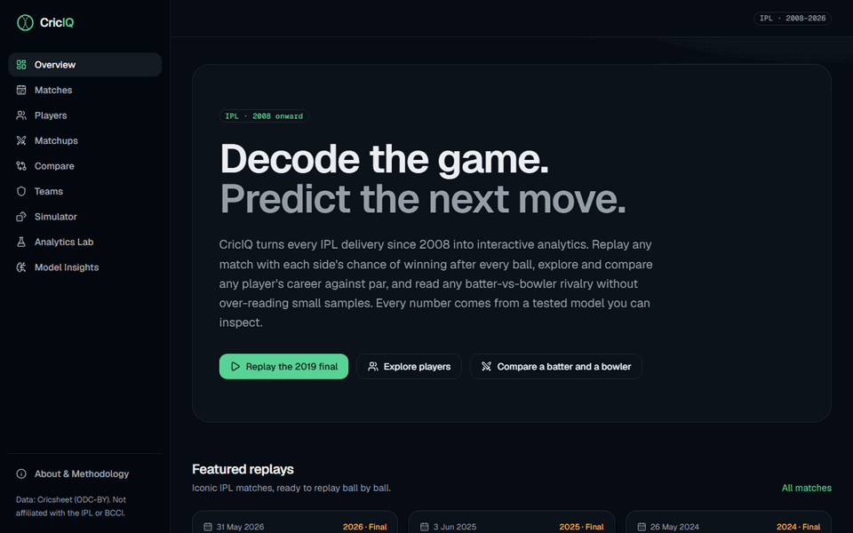
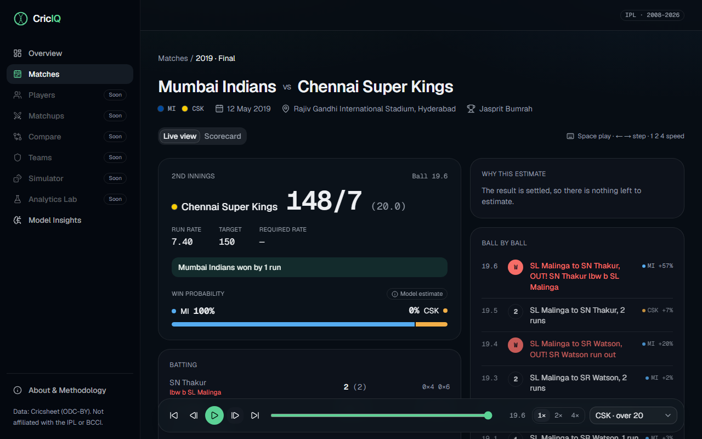
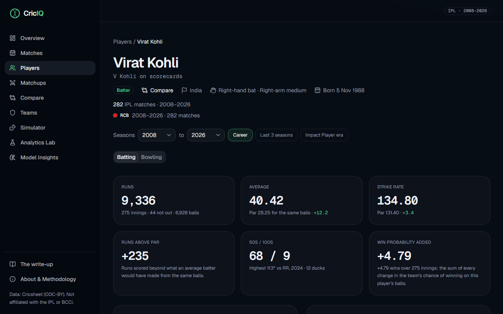
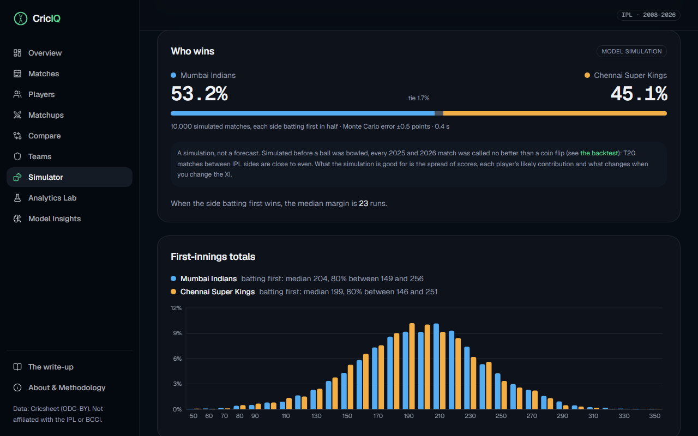
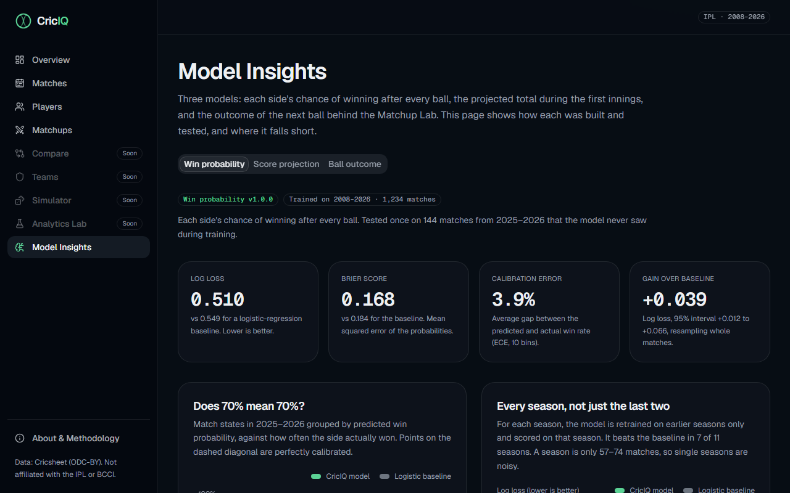

<div align="center">

# CricIQ

### AI-Powered Cricket Intelligence Platform

**Decode the game. Predict the next move.**

[](https://github.com/mehulp007/CricIQ/actions/workflows/ci.yml)


**[Run it on your machine](#run-it-on-your-machine)** · [Live demo (IPL edition)](https://criciq-eight.vercel.app) · [Write-up](https://criciq-eight.vercel.app/writeup) · [Models and results](docs/models.md)



</div>

---

CricIQ turns every ball of men's cricket recorded by [Cricsheet](https://cricsheet.org) into
interactive analytics: **Tests, ODIs, T20Is, the IPL, BBL, CPL, PSL and SA20**, about 9,900
matches and 4.6 million balls. Replay any match with a live, explained win probability, follow
every series and tournament, and explore players, rivalries, teams and simulations. Each kind of
cricket has models trained on its own matches only.

> **Two editions.** The [live demo](https://criciq-eight.vercel.app) is v1.0.0, the IPL edition
> (branch `main`). **v2.0.0, every competition, is on the `v2` branch and runs on your machine.**

## Run it on your machine

### 1. Install these once

| Tool | Windows | macOS / Linux |
|---|---|---|
| [Git](https://git-scm.com/downloads) | Installer from git-scm.com | Usually installed already |
| [uv](https://docs.astral.sh/uv/) (it also installs Python for you) | `powershell -ExecutionPolicy ByPass -c "irm https://astral.sh/uv/install.ps1 \| iex"` | `curl -LsSf https://astral.sh/uv/install.sh \| sh` |
| [Node.js 24 LTS](https://nodejs.org) | Installer from nodejs.org | Installer from nodejs.org |
| [pnpm](https://pnpm.io) | `npm install -g pnpm` | `npm install -g pnpm` |

**Then close the terminal and open a new one**, so it finds the new programs.

### 2. Download CricIQ and start it

```bash
git clone -b v2 https://github.com/mehulp007/CricIQ.git
cd CricIQ
uv run python scripts/v2_up.py
```

The first run takes about 25 minutes on a laptop. It downloads the data (about 45 MB), builds and
checks every competition (about 1.5 GB on disk), scores every ball with the trained models and
builds the website. When it prints **`CricIQ is up`**, open **http://localhost:3000**. Press
**Ctrl+C** in the terminal to stop it.

### 3. Next time

```bash
cd CricIQ
uv run python scripts/v2_up.py --serve-only
```

It starts in seconds, using the data already built. To add matches played since then, run
`uv run criciq-data sync`; the running site picks them up by itself.

### If something goes wrong

| You see | Do this |
|---|---|
| `'git'`, `'uv'` or `'npm'` is not recognized | Install it (step 1), then open a **new** terminal |
| `npm.ps1 cannot be loaded because running scripts is disabled` | Run `npm.cmd install -g pnpm` instead |
| `pnpm is not installed` or `Node.js is not installed` | Install it (step 1), then open a new terminal |
| `port 3000` or `port 8000 is already in use` | CricIQ is already running in another window: use that one, or close it first |
| `scripts/v2_up.py` does not exist | You have the IPL edition (`main`): run `git checkout v2` inside the folder |
| The page does not open | Wait for `CricIQ is up`, then use http://localhost:3000 |

## What you can do

- **Replay any match** ball by ball, with each side's win chance, a projected total and a
  plain-language explanation after every ball.
- **Series and tournaments**: every international series and World Cup, with tables, knockouts and
  champions.
- **Player Lab**: every player's career in every format, measured against par for their era, with
  ratings, splits and similar players.
- **Matchups and Compare**: any batter against any bowler without over-reading small samples, and
  any two players side by side.
- **Teams**: seasons, league tables rebuilt from the balls (identical to the official ones) and head
  to heads.
- **Match Simulator and what-if**: play two limited-overs sides 10,000 times in about half a second,
  or change the score in any replay and see what follows. Tests get a chase calculator.
- **Analytics Lab**: research notes that test ideas like momentum, clutch, the toss and home
  advantage, including the answers that came out "no".
- **Model Insights**: every model against its baseline on matches it never saw.

## How good are the models

Each model is tested once on the 2025–2026 matches, which were never used for training or tuning.

| Competition | Win probability, log loss (lower is better) | Projected total, typical miss |
|---|---|---|
| IPL | **0.510** vs 0.549 baseline | **16.9 runs** vs 18.4 for par |
| BBL, CPL, PSL, SA20 | **0.504** vs 0.516 | **16.8 runs** vs 18.2 |
| T20Is | **0.432** vs 0.458 | **18.1 runs** vs 22.2 |
| ODIs | 0.550 vs 0.552: level, and the site says so | **31.2 runs** vs 38.0 |
| Tests (win, draw or loss) | **0.633** vs 0.651 | **63 runs** vs 67 (mean) |

Full results, what failed and why: [docs/models.md](docs/models.md).

## Screenshots

| Match replay | Player Lab |
|---|---|
|  |  |
| **Match Simulator** | **Model Insights** |
|  |  |

## How it's built

- **Data:** Cricsheet's ball-by-ball files go into a DuckDB warehouse, are validated against
  invariants, golden scorecards and 27 known results, then exported as one serving database per
  competition.
- **Models:** LightGBM, multinomial regression and empirical Bayes, each tested against a baseline
  and committed with a model card. Every real ball's predictions are computed ahead of time;
  simulations and what-ifs run live.
- **API and site:** FastAPI reads the serving databases; Next.js renders the pages and replays
  each match in the browser.
- **Quality:** 480+ Python tests, 120+ frontend tests and 240 end-to-end tests, plus an
  accessibility scan of every key page, run in CI on every push.

| Layer | Tools |
|---|---|
| Data and ML | Python 3.12, DuckDB, LightGBM, scikit-learn, SciPy |
| Backend | FastAPI, Pydantic, uvicorn |
| Frontend | Next.js 16, TypeScript, Tailwind CSS, shadcn/ui, Recharts |
| Quality | uv, ruff, mypy, pytest, Vitest, Playwright, axe-core, GitHub Actions |

More: [architecture](docs/architecture.md) · [data pipeline](docs/data-pipeline.md) ·
[models and results](docs/models.md) · [training](docs/training.md) ·
[decision records](docs/adr/) · [changelog](CHANGELOG.md)

## For developers

The repository has a task runner, [just](https://just.systems) (`uv tool install rust-just`, then
`uv tool update-shell` and a new terminal). `just` lists every task; the main ones:

```bash
just setup      # install dependencies and git hooks
just check      # everything CI runs: lint, types, tests, build
just v2-up      # same as scripts/v2_up.py (--serve-only, --no-download, --dev)
just sync       # take in new and corrected matches
just train-group leagues   # retrain one model group: ipl, leagues, t20i, odi or test
```

```
core/  pipelines/  ml/  backend/  frontend/   the packages and the web app
config/  reference/  models/                  configuration, player data, trained models
docs/  notebooks/  tests/                     documentation, research, tests
```

## Data & attribution

Ball-by-ball data is from [Cricsheet](https://cricsheet.org) under the [Open Data Commons Attribution License](https://opendatacommons.org/licenses/by/1-0/). Player attributes come from [Wikidata](https://www.wikidata.org) (CC0) and English [Wikipedia](https://en.wikipedia.org) ([CC BY-SA 4.0](https://creativecommons.org/licenses/by-sa/4.0/)).

CricIQ is an independent portfolio project, not affiliated with the ICC or any board, league or
franchise. Predictions and simulations are statistical estimates, not guarantees, and are not
intended for betting.

## License

[MIT](LICENSE) © 2026 Mehul Patil
