<div align="center">

# CricIQ

### AI-Powered Cricket Intelligence Platform

**Decode the game. Predict the next move.**

[](https://github.com/mehulp007/CricIQ/actions/workflows/ci.yml)


**[Live demo → criciq-eight.vercel.app](https://criciq-eight.vercel.app)** · v0.1.0 (MVP)

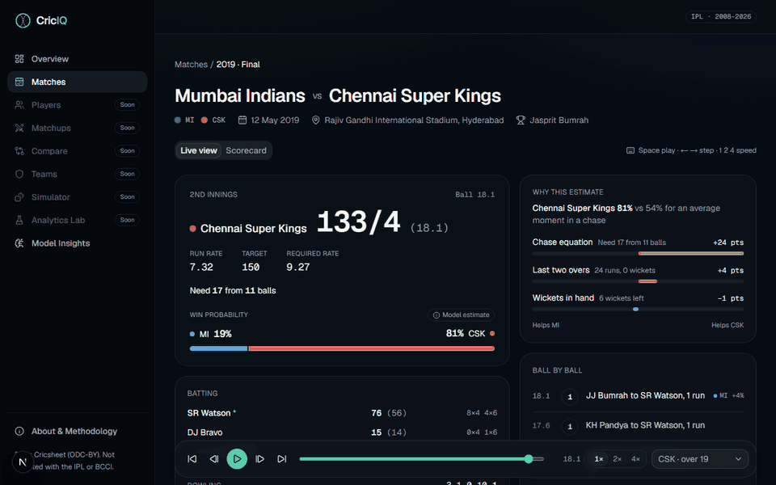

</div>

---

CricIQ turns every IPL delivery since 2008 into interactive analytics. Today you can replay any match ball by ball with an explainable win probability and a projected total after every delivery, explore every player's career measured against par, read any batter-vs-bowler rivalry without over-reading small samples, rate players with honest allowances for sample size, see the pressure on every ball, rebuild any season's league table, and simulate any two XIs 10,000 times, all behind a polished web interface.

It is built as a **full ML product, not a dashboard**. Raw data goes through data engineering, then leak-free feature engineering, statistically validated models, explainability, a versioned API, the frontend and finally deployment.

> **Status:** **v0.1.0, the MVP, is released** (milestones M0–M6), and V1 is under way: **V1-a** added a Compare page, CricIQ Ratings and similar players; **V1-b** adds pressure and momentum to every replay and the Analytics Lab. Replay every IPL match since 2008 with each side's chance of winning, and the reasons, after every ball; see a projected first-innings total with an honest range; explore and compare any player's career against par; and compare any batter with any bowler. See the [roadmap](#roadmap) and the full [engineering plan](docs/PLAN.md).

## At a glance

| | Result (tested once on the 2025–2026 seasons, never used for training or tuning) |
|---|---|
| Win probability | Log loss 0.510 vs 0.549 for a logistic baseline (95% CI of the gain excludes zero); calibration reported |
| Score projection | 80% range covers 80.3% of first-innings totals; median error 16.9 runs vs 18.4 for par |
| Ball outcome | 1.07% better log loss than phase-and-wickets frequencies; better in 11 of 11 backtest seasons |
| Matchups | Head-to-head prior fitted by empirical Bayes (355 balls); raw records predict a pair's future far worse than shrunk ones |
| Ratings | 16 rating components shrunk by empirical Bayes: the shrunk record predicts a player's next season better than the raw record for all 16; year-to-year stability reported per component |
| Pressure | Leverage of every ball from what-if win probabilities; expected and realised next-ball swings agree in every tenth, from 0.09× to 2.9× a typical ball |
| League tables | Rebuilt from the balls for all 19 seasons and identical to the official tables, net run rate included; the build fails if they ever differ |
| Simulator | 10,000 complete matches in about a second; first-innings totals calibrated on 2025–2026 (PIT uniform); pre-match winners no better than a coin flip, reported as such |
| Quality | 280+ Python tests, 90+ frontend unit tests, 100+ end-to-end tests on desktop and mobile, axe WCAG 2.1 AA scan of every key page |
| Performance | Lighthouse 95–100 performance (mobile, throttled) and 100 on desktop; 100 accessibility and best practices on every key page |

## Features

| Feature | What it does | Status |
|---|---|---|
| Match Explorer & Replay | Browse any IPL match and replay it ball by ball: live scoreboard, commentary, worm and Manhattan charts, live scorecard, play/step/seek/speed controls and keyboard shortcuts | **Live** |
| Win Probability | Each side's chance after every ball, with a chart, turning points and plain-language TreeSHAP explanations | **Live** |
| Model Insights | Calibration, a season-by-season backtest, baselines, rejected features and the biggest swings in IPL history | **Live** |
| Score Projection | Projected first-innings total, a conformally calibrated 80% range, the odds of passing round totals, and a projection fan on the worm | **Live** |
| Player Lab | Search every player; profiles with era- and phase-adjusted numbers ("par"), CricIQ Ratings, similar players, win probability added, season trends, recent form and splits by phase, bowler type, batter hand, position, innings, result, opposition and venue, for any season window | **Live** |
| Matchup Lab | Any batter vs any bowler: the raw record, what their overall records predict, and an empirical-Bayes estimate with 90% intervals and sample-size badges; next-ball odds by phase; rivalry lists ranked by the matchup effect beyond form | **Live** |
| CricIQ Ratings | 0-100 ratings against the regulars of the same seasons for 8 batting and 8 bowling components, shrunk by how much a record of that size can be trusted, with 90% intervals and a stability label | **Live** |
| Compare | Any two players over the same seasons: numbers against par, ratings on shared tracks, season-by-season form by year or by age, phases and their head-to-head | **Live** |
| Similar players | The closest style profiles (per-ball rates against par and how a player is used) in the same seasons, with shared traits | **Live** |
| Pressure & momentum | Every replay shows the pressure on the next ball (how much it can move the match) and each side's momentum over the last 12 balls, with a pressure chart and the tensest moments | **Live** |
| Teams | Every franchise's seasons, league tables that match the official ones, results by situation, phases against par, comebacks and collapses, and any head-to-head set against what form predicted | **Live** |
| Analytics Lab | Research notes with tests that could have gone either way: is momentum real, what pressure does to batting, is clutch a skill, do rivalries repeat | **Live** |
| Match Simulator | Any two XIs played 10,000 times, ball by ball: win shares, the spread of totals and each player's likely contribution, labelled as a model simulation and backtested | **Live** |
| What-if sandbox | In any replay, change the score at any ball and see how the rest of the match changes | **Live** |

## The data

Every IPL match since 2008 is ingested ball by ball from Cricsheet, normalized into a DuckDB warehouse
and validated before anything downstream sees it.

| | |
|---|---|
| Seasons | 2008–2026 (19) |
| Matches | 1,243 |
| Deliveries | 295,732 |
| Players | 816, with attributes for ~98% of those with a meaningful sample |
| Validation | 17 invariant checks + 6 golden scorecards, all passing ([report](docs/data-quality-report.md)) |

What the exploration found, and how it shapes the models ([notebook](notebooks/01_eda.ipynb)):

- **About 1,200 outcomes, not 300k rows.** Deliveries within a match share one result, so models stay
  modest and are split by season.
- **Scores rose about 27 runs in the Impact Player era** (163 → 190 average first-innings total), so
  every model gets an as-of run-environment feature and is tested on the latest seasons.
- **The median batter–bowler pair has faced just 5 balls**, so matchup estimates are shrunk toward
  sensible baselines instead of over-reading tiny samples.

Details: [data pipeline](docs/data-pipeline.md) · [data dictionary](docs/data-dictionary.md)

## The win probability model

Two monotonic LightGBM models (first innings and chase), tested once on the 144 matches of 2025–2026
that they never saw ([model card](docs/model-cards/win-probability.md)):

| Test seasons 2025–2026 | Log loss | Brier | ECE | AUC |
|---|---|---|---|---|
| **CricIQ win probability** | **0.510** | **0.168** | 0.039 | 0.832 |
| Boosted trees on the match state only | 0.543 | 0.182 | 0.020 | 0.795 |
| Logistic regression on the match state | 0.549 | 0.184 | 0.034 | 0.791 |

- **Better than the baseline, with uncertainty measured honestly:** +0.039 log loss (95% CI +0.012 to
  +0.067), resampling whole matches because balls within a match are correlated. A season-by-season
  backtest (2016–2026) is published too: the model wins 7 of 11 seasons.
- **Leak-free by construction:** every feature uses only that ball or earlier matches. A test deletes
  and rewrites all later matches and checks that no earlier feature changes.
- **Honest negative results:** player, venue and squad strength were built as-of and tested season by
  season. None improved on the match state plus the scoring era, so none is used.
- **Sharp at the finish:** a WASP-style dynamic programme computes the exact chance of a chase from
  runs, balls and wickets, where data is thinnest.
- **Every choice made on validation data:** hyperparameters, calibration (none vs Platt, decided by a
  rolling origin) and features. Model versions are committed and gated; deploys only score
  ([ADR-0004](docs/adr/0004-committed-models-precomputed-predictions.md)).

Experiments: [notebook 02](notebooks/02_wp_experiments.ipynb) (LightGBM vs XGBoost vs CatBoost, the
chase feature, the 2019 final explained).

## The score projection model

Quantiles of the final first-innings total after every ball, predicted relative to the scoring era
and conformally calibrated ([model card](docs/model-cards/score-projection.md)). Tested once on the
143 first innings of 2025–2026:

| Test seasons 2025–2026 | 80% range covers | Median error (runs) | Pinball |
|---|---|---|---|
| **CricIQ projection** | **80.3%** | **16.9** | **4.87** |
| Par for the era + historical spread | 79.7% | 18.4 | 5.46 |
| TV-style run-rate projection | — | 27.9 | — |

The median error beats par in 11 of 11 backtest seasons. Season bias stays within a few
runs either way, with no drift as totals rose by 30 runs across eras.

## Player Lab: measured against par

A strike rate of 135 meant something different in 2010 than in 2025, and in the powerplay than at the
death. Every Player Lab number therefore comes with **par**: what an average IPL player would have
produced from the same balls, using the league rate for each ball's season and phase. Summed over all
players, par reproduces the league exactly (a tested invariant).

- **Runs above par / runs saved:** Kohli has scored 235 runs more than par from his 6,926 balls; Bumrah
  has conceded 948 fewer.
- **Win probability added** credits every ball's change in the win probability to the batter and,
  negated, to the bowler. Narine (bowling), de Villiers and Warner (batting) lead the career totals.

Splits are precomputed as innings rows and ball-level cells, so any season window is one small
aggregate. They are checked against an independent recount of the raw Cricsheet JSON and known
scorecards (Kohli's 973 runs in 2016, Gayle's 175*, Alzarri Joseph's 6/12).

## CricIQ Ratings: trusting a record only as far as it deserves

A rating places a player among the regulars of the same seasons (300+ balls) on one thing they do,
from 0 to 100. Before ranking, each record against par is blended with the average:
`(own evidence + k × average) ÷ (own balls + k)`, where `k` is fitted per component so a season's
shrunk record best predicts the player's next season, and tested on 2023-2026. Every rating carries
a 90% interval. There is deliberately no overall number.

- Shrinking beats trusting the raw record for all 16 components when predicting a player's next
  season, by 15-50%.
- A batter's strike rate against par counts for half the estimate after about 460 balls; a bowler's
  economy after about 320; **wickets against par need about 3,800**, because over a season they are
  mostly luck. Runs conceded say more about a bowler than wickets do.
- Year-to-year stability is reported for every component, and the low ones (powerplay batting,
  wicket-taking, defending) are flagged in the app.

**Similar players** compare style profiles (per-ball rates against par and how a player is used),
z-scored within the same seasons, by cosine similarity. From one season's profile, the same bowler
is among the five closest next season 58% of the time (chance: 12%). **Compare** puts any two
players side by side over the same seasons. Formulas are in [docs/metrics.md](docs/metrics.md).

## Pressure, momentum and the Analytics Lab

Before every ball, CricIQ tries each possible outcome, scores the resulting state with the win
probability model and weights the swings by how often each outcome happens: the **leverage**, or how
many typical balls this one is worth (the Leverage Index from baseball analytics). Its percentile is
the **pressure index** in the replay. Grouped into tenths, the swings it expects match the swings
that happen, from the calmest balls to the tensest (about 33× a typical ball: 3 or 4 needed off the
last ball).

The [Analytics Lab](https://criciq-eight.vercel.app/lab) publishes the tests, including the "no"s:

- **Momentum** (win probability gained over the last 12 balls) is descriptive, not predictive: after
  a 15-point surge sides score half a run more than expected over the next two overs, lose slightly
  more wickets, and do not win any more often than the win probability says.
- **Pressure** changes behaviour at the end of close chases: batters score about 8 runs per 100 balls
  above expectation and get out more often.
- **Clutch** is not a reliable skill: a batter's record under pressure in odd seasons predicts it in
  even seasons with r = 0.17, far below the 0.3 the plan required for a rating, so there is none.

## Teams: official tables, rebuilt

Every league table since 2008 is rebuilt from the balls: points, wins, and net run rate under the
playing conditions (a side bowled out is charged its full overs, a rain-revised chase credits the
side batting first with the target minus one, an umpire's seven-ball over counts as one). With 12
fixtures abandoned before a ball (missing from Cricsheet) and one voided match added, **all 19
seasons match the official tables exactly**, and the build fails if they ever stop matching.

Franchise pages split results by batting order, toss, home ground and stage, measure batting and
bowling in each phase against par, and find each side's greatest comebacks and costliest defeats
from the win probability of every ball. Head-to-head records are set against what each side's
form going into the match predicted, and the [Lab note](https://criciq-eight.vercel.app/lab/rivalries)
shows why: across every IPL rivalry, past head-to-head records add nothing to form, close-finish
records do not carry over, and even form is a weak guide (the side in better form wins 53% of the
time; a season's win rate predicts the next season's with r = 0.06).

## Match simulator and what-if, backtested

The [simulator](https://criciq-eight.vercel.app/simulator) plays any two XIs ball by ball with the
ball-outcome model: extras and run outs at league rates, each over's bowler drawn from how that
bowler was used (four overs each, never twice in a row, and only if the innings can still be
finished), and match conditions drawn per match and shared by both innings. All 10,000
simulations step forward together as numpy arrays, so a full simulation takes about a second
([ADR-0006](docs/adr/0006-simulator-in-the-api-with-numpy.md)).

Backtested on every 2025–2026 match before a ball was bowled, with a ball model that never saw
those seasons ([model card](docs/model-cards/simulator.md)):

| Check | Result |
|---|---|
| First-innings totals | PIT uniform (χ² 10.6, 5% threshold 16.9); 86% inside the simulated 80% range |
| From the first ball of a chase | Brier 0.193 against 0.246 for the base chase rate, but chances run about 10 points low |
| Winner, pre-match | Brier 0.256 against 0.250 for a coin flip: no better, and the page says so |

Because simulated chases run low, the replay's **what-if** starts from the calibrated win
probability at the real score and adds only the simulated change from your edit.

## Matchup Lab: small samples, honestly

The longest IPL rivalry is about 160 balls; the median batter-bowler pair has met for 5. A ball-outcome
model (multinomial logistic regression with penalised batter and bowler effects,
[model card](docs/model-cards/ball-outcome.md)) predicts dot, 1, 2, 3, 4, 6 or wicket for every ball, and
each head-to-head record is shrunk towards what it expects for those same balls. The prior's strength
is fitted across all 31,000 pairs (empirical Bayes): **355 balls**, so history never carries
more than about 31% of an estimate.

| Test seasons 2025–2026 | Log loss |
|---|---|
| **CricIQ ball model** | **1.4895** |
| Match situation only (no players) | 1.4945 |
| Phase and wickets frequencies | 1.5057 |

On the 15,102 test balls between pairs who had met before, raw head-to-head rates
predicted those balls far worse than the model (1.667 vs 1.464);
the shrunk record matched or beat it (1.464). Head-to-head records are mostly
noise around what the players' overall records already say.

## Screenshots

| Overview | Match Explorer |
|---|---|
| 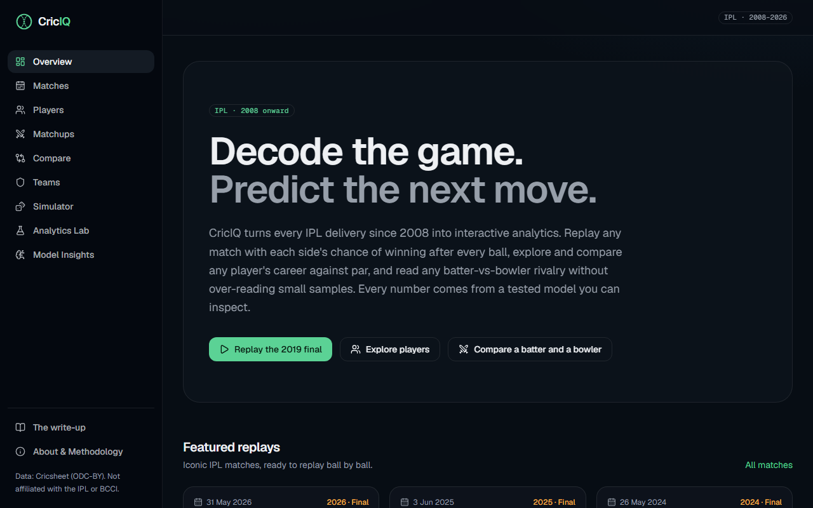 | 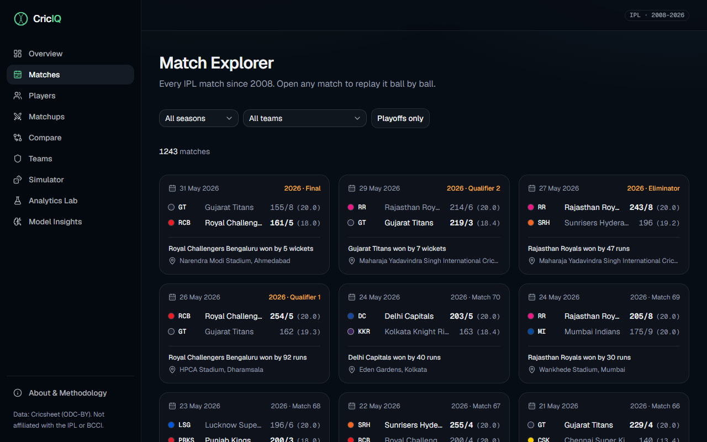 |
| **Match Center** | **Model Insights** |
|  |  |
| **Player Lab** | **Matchup Lab** |
|  | 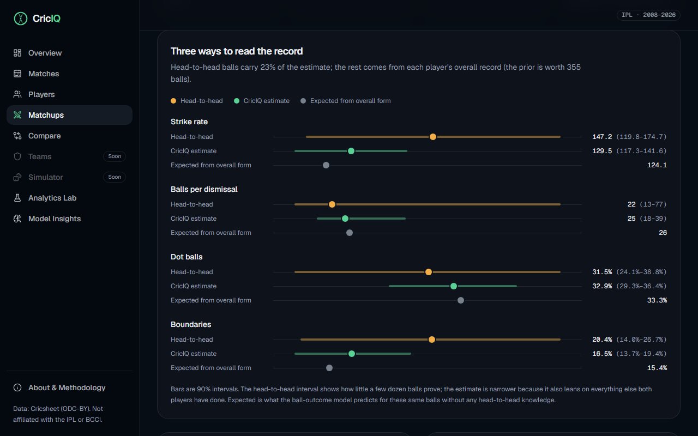 |
| **CricIQ Ratings and similar players** | **Compare** |
| 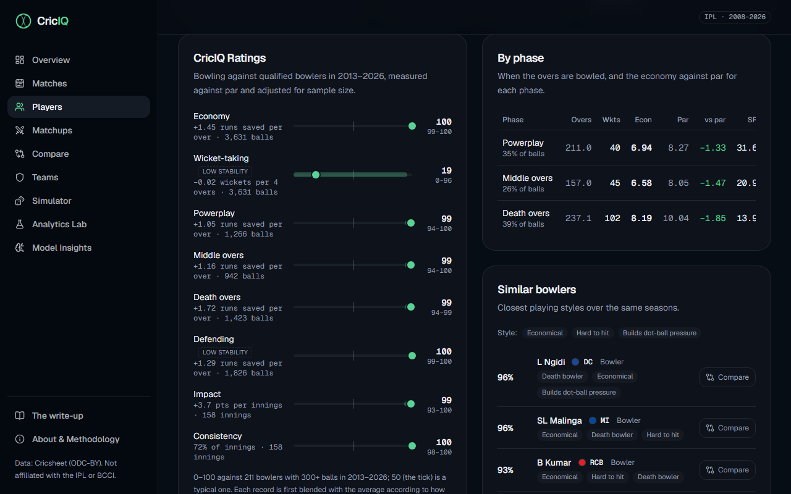 | 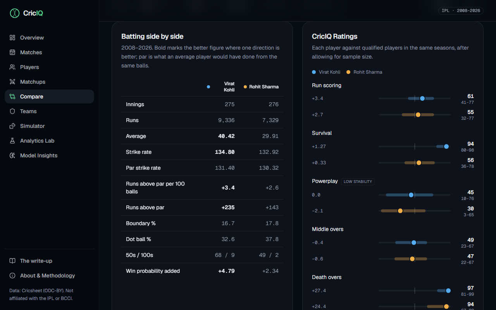 |
| **Pressure in the replay** | **Analytics Lab** |
| 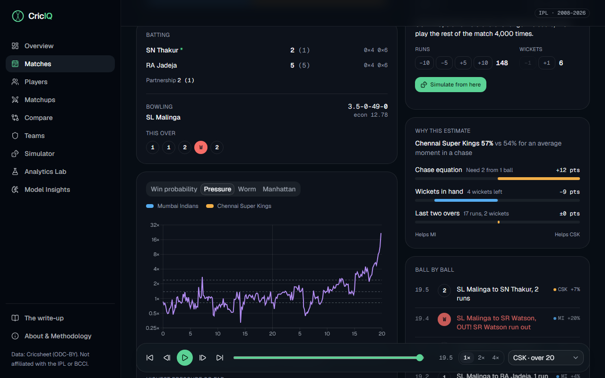 | 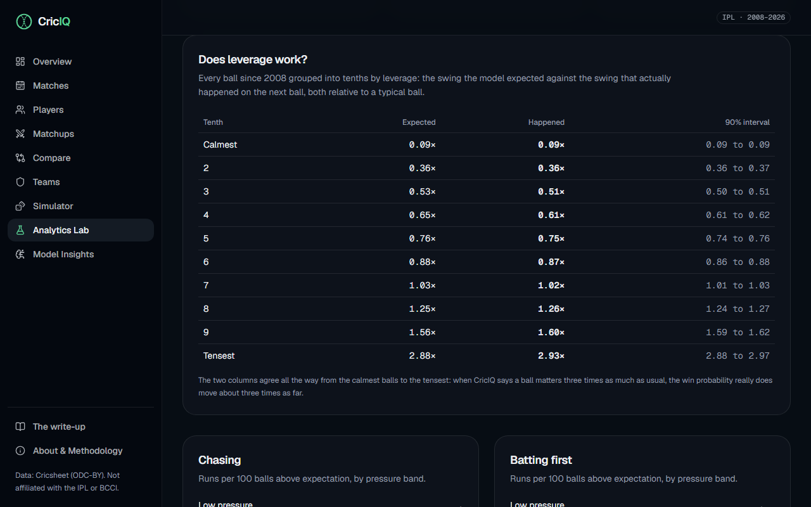 |
| **Teams** | **Head to head** |
| 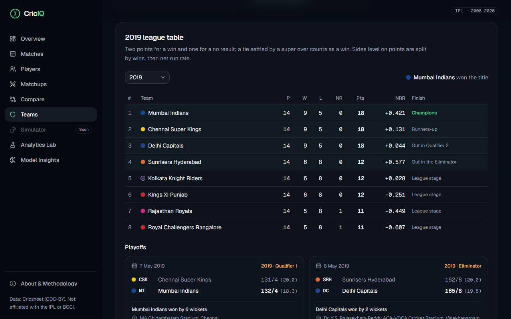 | 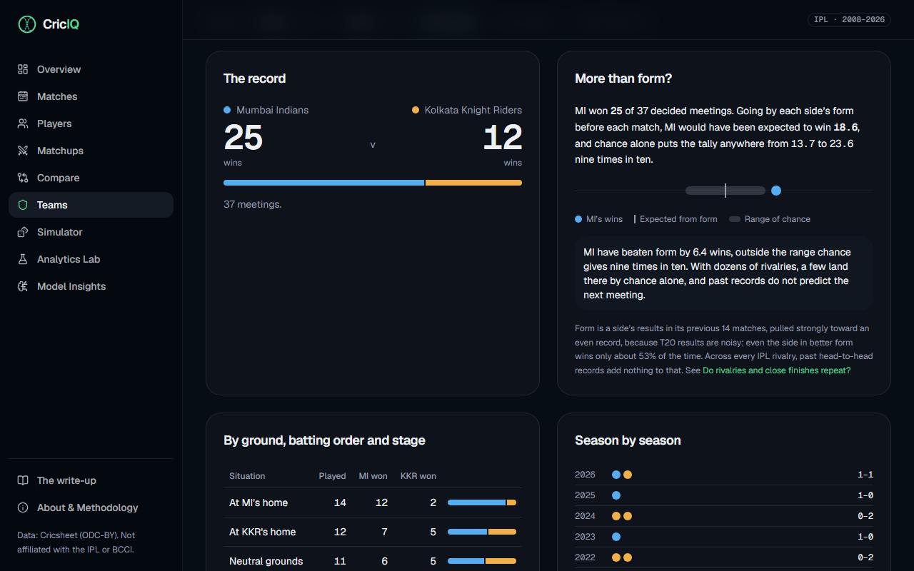 |
| **Match Simulator** | **What-if in the replay** |
|  | 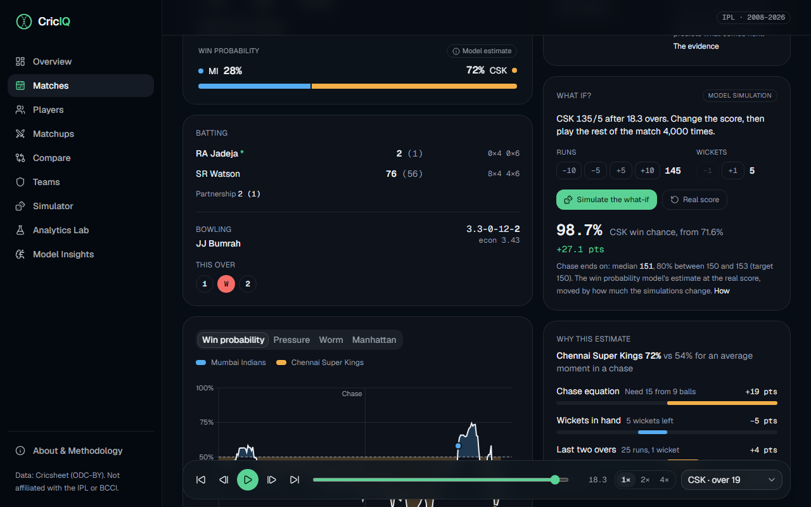 |

## Architecture

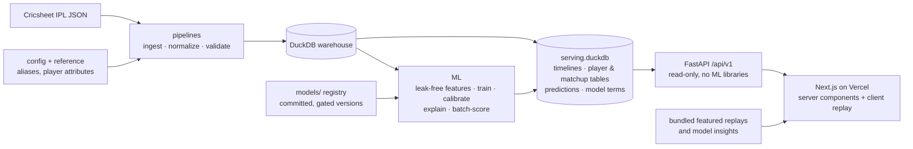

The API image is built from the latest Cricsheet data: the build validates it, exports the serving
database and scores every ball with the committed models, so the API never trains or loads an ML
library. The replay runs entirely in the browser from a single timeline payload per match, with no
per-ball API calls. Next-ball odds for any pair are computed from the ball model's stored terms with
plain arithmetic ([ADR-0005](docs/adr/0005-ball-model-as-additive-terms.md)).

Read more in [docs/architecture.md](docs/architecture.md), [docs/deployment.md](docs/deployment.md),
the [architecture decision records](docs/adr/) and the model cards for
[win probability](docs/model-cards/win-probability.md),
[score projection](docs/model-cards/score-projection.md) and
[ball outcome](docs/model-cards/ball-outcome.md) and
[CricIQ Ratings](docs/model-cards/ratings.md), with every derived metric defined in
[docs/metrics.md](docs/metrics.md). The site's
[About & Methodology](https://criciq-eight.vercel.app/about) page explains every number in plain terms.

## Tech stack

| Layer | Tools |
|---|---|
| Data | Python 3.12, DuckDB, Parquet (pyarrow), SQL validation checks, Typer |
| ML | LightGBM (monotonic constraints, quantile regression, exact TreeSHAP), scikit-learn (multinomial logistic regression), SciPy (empirical Bayes); XGBoost and CatBoost for comparison |
| Backend | FastAPI, Pydantic v2, uvicorn |
| Frontend | Next.js (App Router), TypeScript, Tailwind CSS, shadcn/ui, Recharts |
| Quality | uv workspace, ruff, mypy (strict), pytest, Vitest, Testing Library, Playwright, axe-core, Lighthouse, GitHub Actions |
| Hosting | Vercel (web, Mumbai), Render (API in Docker, Singapore), free tiers |

## Testing and quality

Every push runs four CI jobs: Python (ruff, strict mypy, pytest), frontend (ESLint, Prettier,
TypeScript, Vitest, production build), the API image (built from live Cricsheet data, validated,
scored and smoke-tested) and end-to-end (Playwright on desktop and mobile against a real API).

- **Data:** invariant checks and golden scorecards on every build; player tables are checked against
  an independent recount of the raw JSON.
- **Models:** leakage tests that rewrite later matches, monotonicity and terminal-state checks, and a
  test that the API's next-ball arithmetic matches the fitted model to 1e-9.
- **Web:** an axe-core scan for WCAG 2.1 A and AA on every key page, on desktop and mobile.

## Local development

**Prerequisites:** Python 3.12 (managed by [uv](https://docs.astral.sh/uv/)), Node 24 with [pnpm](https://pnpm.io), and [just](https://just.systems) (`uv tool install rust-just`).

```bash
just setup      # install Python + frontend deps and git hooks
just dev-api    # API on http://localhost:8000 (OpenAPI docs at /docs)
just dev-web    # web app on http://localhost:3000
just check      # everything CI runs: lint, types, tests, build
just data run   # download Cricsheet data, rebuild, validate and export the serving database
just ml score   # add every ball's win probability from the committed model
just ml train win_probability   # or score_projection, ball_outcome: retrain, evaluate, backtest
just e2e        # Playwright end-to-end tests (desktop + mobile) against the running app
```

## Project structure

```
core/        criciq_core: cricket rules, phase config, shared feature definitions
pipelines/   criciq_pipelines: ingestion → normalization → validation → export
ml/          criciq_ml: features, training, evaluation, inference, explainability, simulation
backend/     criciq_api: FastAPI app (routers → services → repositories)
frontend/    Next.js app
config/      versioned reference config (franchises, venues, phases, golden matches)
reference/   curated player attributes and documented overrides
notebooks/   exploration and research (executed, with outputs)
docs/        plan, architecture, ADRs, model cards, metric definitions
tests/       Python tests + real-match fixtures for every data edge case
```

## Roadmap

- [x] **M0** Foundations: monorepo, tooling, CI, design system, app shell
- [x] **M1** Data warehouse: Cricsheet ingestion, normalization, validation
- [x] **M2** Match Explorer & Replay: first public deployment
- [x] **M3** Win Probability: calibrated, explainable, backtested
- [x] **M4** Score Projection: conformal quantiles, honest ranges
- [x] **M5** Player Lab: profiles against par, splits, WPA
- [x] **M6** Matchup Lab + ball-outcome model: empirical-Bayes head-to-head, next-ball odds
- [x] **v0.1.0 MVP release:** polish, methodology page, Lighthouse and accessibility audit
- [x] **V1-a** Compare page, CricIQ Ratings, similar players
- [x] **V1-b** Momentum and pressure in the replay, Analytics Lab research notes
- [x] **V1-c** Team analytics and head-to-head
- [x] **V1-d** Match simulator and what-if sandbox

## Data & attribution

Ball-by-ball data is from [Cricsheet](https://cricsheet.org), used under the [Open Data Commons Attribution License](https://opendatacommons.org/licenses/by/1-0/). Player attributes come from [Wikidata](https://www.wikidata.org) (CC0) and English [Wikipedia](https://en.wikipedia.org) cricketer infoboxes ([CC BY-SA 4.0](https://creativecommons.org/licenses/by-sa/4.0/)).

CricIQ is an independent portfolio project. It is not affiliated with the IPL, the BCCI or any franchise. All predictions and simulations are statistical model estimates, not guarantees, and the project is not intended for betting.

## License

[MIT](LICENSE) © 2026 Mehul Patil
